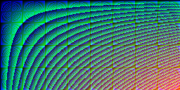

# Final Project

This project is an image generator using one of 32,768 for each pixel ([15bit color depth](https://en.wikipedia.org/wiki/High_color)) w/ different algorithms using Haskell. It is for my final project in my Programming Languages class CS4003 during the Fall semester of 2017.

## Rules

1. Only one color per pixel of the image; an RGB value can not be used more than once.
1. Each of the individual 32,768 possible color values must be used.

## Inspiration

<https://codegolf.stackexchange.com/questions/22144/images-with-all-colors>

## Tools/Resources

- [](https://www.haskell.org/)
- [ JuicyPixels package](https://hackage.haskell.org/package/JuicyPixels)
- [Haskell WikiBook](https://en.wikibooks.org/wiki/Haskell)

## How to use

Change directory in cmd line to the directory with the `meltyIceCream.hs` file
````cmd
cd finalproject
````
Run the GHC
````cmd
ghc --make meltyIceCream.hs
````
Run the meltyIceCream module
````cmd
meltyIceCream.exe
````

A new image file named `meltyIceCream.png` will be created based on the algorithm within the meltyIceCream function.
The image should look similar to this:


## Uniquely Colored Pixels

Creating an image with individually uniquely colored pixels is very easy using Haskell and the hackage JuicyPixels. Within JuicyPixels there is a function called `generateImage` that takes a function and 2 integer values as arguments. It uses the two integer values to determine the width and height of the image and also uses them to determine the inputs to the function argument. By iterating from 0 to `width - 1` for the x value and 0 to `height - 1` for the y value, we can simply make the function argument return the input values for x (width) and y (height). Since the iteration never repeats the same value, we instantly have an algorithm that creates a uniquely colored pixel that matches no other pixel within the image. But this is no fun, so I am going to explore much more complicated algorithms in hopes of creating some impressive images.

## Un-Aware Algorithms

My first few attempts at creating an interesting image were simple algorithms that were not 'aware' of the other pixels and their colors. [At least not like the winning project of the referenced inspiration.](https://codegolf.stackexchange.com/questions/22144/images-with-all-colors/22326#22326)
Since C# is my primary language it was very easy for me to understand how [fejesjoco](https://codegolf.stackexchange.com/users/14701/fejesjoco)'s solution worked. So I figured trying to convert this solution into Haskell could be an interesting challenge that I could use to further my understanding of Haskell and the functional programming paradigm. Even though C# implements many functional programming aspects from FP languages, including Haskell, it does not make the process of creating the same outcome in Haskell easy. Though fejesjoco's solution is well written in C#, it uses many imperitive paradigms that cannot be used in a functionally pure language such as Haskell.

## C# is not Haskell and Haskell is not C#

Trying to take C# code and 'translate' it to Haskell has taught me a lot about Haskell and C#. It has taught me the benefit of using the functional paradigms available in C#. And it has taught me how _wrong_ it feels to try and convert C# to Haskell. The more I try, the more I feel simply _wrong_ from attempting to do this. The C# code uses many states and objects, Haskell has no place for state or objects. The more I grasp and understand the Haskell 'mindset'; the more I realize how silly of an idea it was to attempt this conversion. There are many parts of the C# code that do not translate to anything in Haskell and the logic must be 're-thought'.

For example; if I wanted to take a list and swap every item with its partner, so that this:

`[(0,0,0),(0,0,128),(0,128,0),(0,128,128),(128,0,0),(128,0,128),(128,128,0),(128,128,128)]`

becomes this:

`[(0,0,128),(0,0,0),(0,128,128),(0,128,0),(128,0,128),(128,0,0),(128,128,128),(128,128,0)]`

To create the list I use this:

````haskell
-- will return a list of RGB tuples, the list will contain every RGB combination possible. Increments by 8, max is 256 (exclusive)
allColors :: [(Int, Int, Int)]
allColors = [(r, g, b) | r <- [0, 8..255], g <- [0, 8..255], b <- [0, 8..255]]
````

To 'jossle' the list I use this, and its safe. It will never fail even when given an empty list and will work on a list of any size:

```haskell
recursiveSplitReverse :: [(Int, Int, Int)] -> [(Int, Int, Int)]
recursiveSplitReverse [] = [] -- if empty list, return empty list
recursiveSplitReverse (x:[]) = [x] -- if list only contains 1 item, return that one item in a list
recursiveSplitReverse (x:y:xs) = [y,x] ++ recursiveSplitReverse xs
```

Using this algorithm on a list of tuples (`(Int, Int, Int)`) creates this image:



Understanding Haskell and its pure functional paradigm is not easy, coming from the world of C#. But the focus of using pure FP gives me a feel for the importance of the functional paradigm use in C#. I can see that a focus on functions with no side effects can make unit testing much easier in C#. It will also make the code more readable because to process an object in a specific way the object will need to go through a function, which makes debugging easier since we can know were to look when dealing with specific bugs.